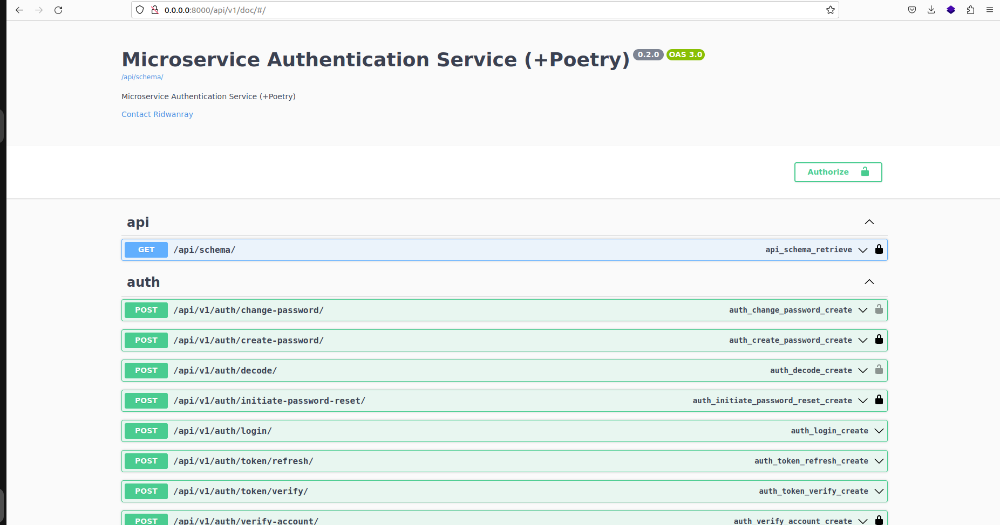
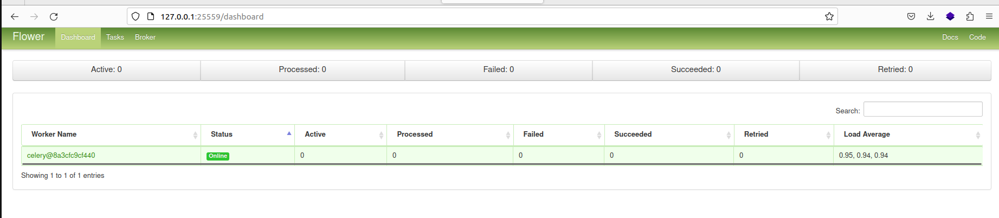
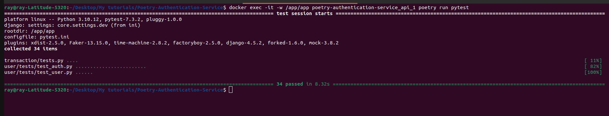

# Django(DRF) Microservice Authentication App (+ Poetry)
Poetry is a packaging and management tool for python

## Tools & Services:
- Django & DRF : for building the APIs
- Docker & Docker compose: Containerization
- Celery: For running background task
- Rabbit MQ: A message broker for celery
- Flower dashboard: For monitoring celery background tasks
- PostgreSQL: Relational DB


## Running locally

Create a .env file by copying the .env.sample provided and run:
```
docker compose build && docker compose up
```
to start the container. As an alternative, run:
```
docker compose -f docker-compose.dev.yml up --build
```
to build and run the container using the dev yaml file.
Make sure to externalize the db instance to be used. It can be in another container.

## Run tests
Run descriptive tests in the container using:
```
docker exec -it -w /app/app <container_name> poetry run pytest
```

Access the docs on:

```
http://localhost:8000/api/v1/doc
```


#  Generating Fixtures (Seeding Permissions)

## Permissions

Load permissions needed in app into the db

```bash
python manage.py loaddata */fixtures/*.json
```

Export Permissions from db

```sh
python manage.py dumpdata  --format=json user.Permission -o core/fixtures/Permission.json
```


Access docs:
```sh
http://localhost:8000/api/v1/doc
```

<br><br><br>

<br><br><br>

<br><br><br>